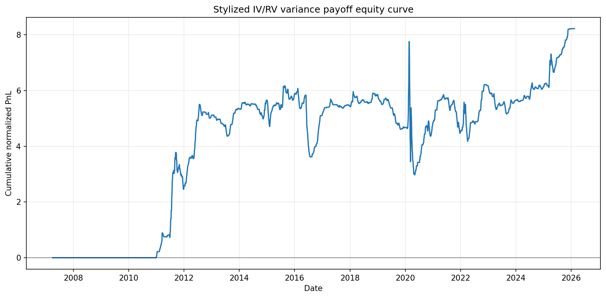
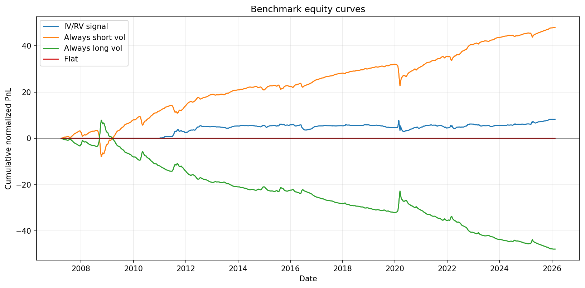
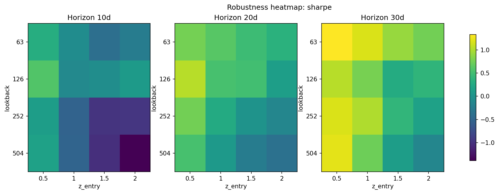

# eurostoxx-iv-rv-backtest

A reproducible empirical volatility research pipeline studying whether the
implied-realized volatility spread on Euro STOXX 50 contains information about
future realized variance.

The project combines SX5E spot data, VSTOXX implied-volatility proxy data,
realized-volatility estimators, no-look-ahead IV/RV signals, stylized variance
payoff diagnostics, benchmark strategies, non-overlapping trade simulation,
robustness grids, walk-forward validation and research-grade reporting.

This is a quant research portfolio project, not a production trading engine or
executable variance-swap strategy.

## Research Question

Does the IV/RV spread contain useful information about subsequent realized
variance, or is the observed performance mostly explained by a naive
short-volatility exposure?

## Recruiter Quick View

- Field: empirical volatility research / equity index derivatives / market risk
- Data: SX5E / Euro STOXX 50 spot and VSTOXX implied-volatility proxy
- Core modelling: realized volatility, forward realized volatility, IV/RV
  spread, z-score signals, stylized variance payoff
- Research discipline: no-look-ahead conventions, non-overlapping trades,
  benchmarks, walk-forward validation, robustness grids, subperiod diagnostics
- Engineering: Python package, CLI scripts, pytest suite, ruff, reproducible CSV
  outputs, Markdown report and figures
- Scope: research-grade diagnostic framework; not a production trading engine

## What This Project Tests

The project tests whether an IV/RV signal is aligned with subsequent realized
variance. It does not prove tradable alpha, executable trading performance or
desk-level variance-swap pricing.

The benchmark layer compares the IV/RV signal against naive
variance-risk-premium exposures: always short volatility, always long volatility
and flat.
This is the key discipline check: if always-short-vol dominates, the report says
so.

## Research Safeguards

The repository includes the following methodological safeguards:

| Safeguard | Included |
|---|---:|
| Explicit no-look-ahead policy | yes |
| Forward realized volatility separated from signal construction | yes |
| Always-short-vol, always-long-vol and flat benchmarks | yes |
| Non-overlapping trade diagnostics | yes |
| Walk-forward validation | yes |
| Subperiod and regime diagnostics | yes |
| Stylized cost sensitivity analysis | yes |
| Reproducible research report | yes |

## Sample Outputs

Selected figures can be published to `docs/figures/` with:

```bash
eurostoxx-generate-figures --publish-docs-figures
```







## Results Snapshot

The numbers below are generated from the current local sample. They are
normalized diagnostics, not returns, EUR PnL, live trading results or desk-level
variance-swap marks.

| Layer | total_pnl | sharpe_approx | max_drawdown | days_in_position |
|---|---:|---:|---:|---:|
| Daily IV/RV signal | 8.222 | 0.753 | -4.784 | 2,227 |
| Non-overlap signal | 0.474 | n/a | n/a | 164 trades |
| Always short vol benchmark | 47.830 | 2.789 | -11.394 | 4,705 |
| Always long vol benchmark | -47.830 | -2.789 | -55.737 | 4,705 |
| Flat | 0.000 | n/a | 0.000 | 0 |

For the full generated table and interpretation, run:

```bash
eurostoxx-generate-report
```

## Key Interpretation

The generated report focuses on four questions:

- Does IV/RV outperform always-short-vol, or is the result mostly naive VRP?
- Is performance concentrated in the short-vol leg?
- How stable is the behavior across subperiods and crisis windows?
- How sensitive are results to stylized signal-change costs?

The project is intentionally honest: weak walk-forward results, benchmark
dominance or crisis concentration are reported directly rather than buried.

## Methodology

The methodology is documented in
[docs/research_methodology.md](docs/research_methodology.md), including:

- data sources and time alignment,
- historical RV and forward RV definitions,
- no-look-ahead conventions,
- IV/RV signal construction,
- stylized payoff convention,
- benchmark definitions,
- walk-forward validation,
- robustness grid,
- cost model and limitations.

## How To Run

Install in editable mode:

```bash
python -m pip install -e ".[dev]"
```

Full local research workflow:

```bash
eurostoxx-build-raw-data
eurostoxx-build-rv
eurostoxx-build-signals
eurostoxx-run-varswap-backtest
eurostoxx-run-non-overlap-varswap
eurostoxx-run-benchmarks
eurostoxx-run-walk-forward
eurostoxx-run-subperiods
eurostoxx-run-cost-sensitivity
eurostoxx-run-robustness
eurostoxx-run-diagnostics
eurostoxx-generate-figures --publish-docs-figures
eurostoxx-generate-report
```

The repository is usable offline after the raw market data has been downloaded.
Tests do not require live internet.

Run quality checks:

```bash
python -m pytest
python -m ruff check .
python -m compileall src
```

## Outputs

Main generated research files:

- `outputs/SXE50_with_IV_RV_daily_20y.csv`
- `outputs/SXE50_with_IV_RV_daily_20y_with_signals.csv`
- `outputs/SXE50_iv_rv_varswap_backtest.csv`
- `outputs/SXE50_iv_rv_non_overlapping_varswap_backtest.csv`
- `outputs/benchmark_comparison.csv`
- `outputs/benchmark_equity_curves.csv`
- `outputs/walk_forward_results.csv`
- `outputs/walk_forward_selected_params.csv`
- `outputs/walk_forward_equity.csv`
- `outputs/subperiod_performance.csv`
- `outputs/cost_sensitivity.csv`
- `outputs/robustness_grid.csv`
- `outputs/research_report.md`
- `docs/research_report.md`
- `docs/figures/*.png`

Generated raw data and full output directories are intentionally ignored by Git.
Only curated documentation artifacts belong in `docs/`.

## Professional Limitations

This project is strong as an empirical research diagnostic, but it is not:

- a tradable variance swap backtester;
- an option-chain backtester;
- a volatility surface model;
- a transaction-cost-aware execution simulator;
- a broker-ready trading system.

Additional limitations:

- VSTOXX is a broad implied-volatility proxy, not a full options surface.
- The payoff is stylized and normalized.
- No bid/ask, slippage, liquidity, financing, margin or funding constraints are
  modeled.
- Non-overlapping trades remain simplified hold-to-expiry diagnostics.
- Robustness grids are sensitivity checks, not a license to tune parameters.

## Repository Structure

```text
.
├── data/raw/
├── docs/
│   ├── figures/
│   ├── research_methodology.md
│   └── research_report.md
├── outputs/
├── src/eurostoxx_iv_rv_backtest/
│   ├── analytics/
│   ├── backtesting/
│   ├── data/
│   ├── features/
│   ├── options/
│   ├── scripts/
│   └── validation/
└── tests/
```
